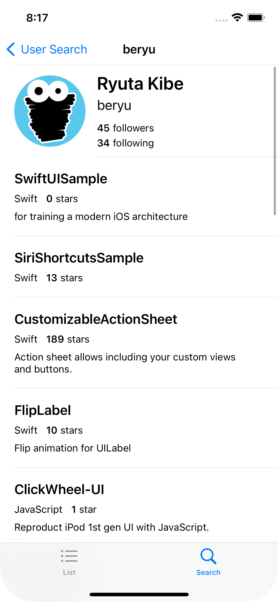

# GitHubViewer
for training a modern iOS architecture

| top | user search | user detail |
| --- | --- | --- |
|  |  |  |

## Requirements
- Xcode 14.3.1

## Setup
1. Execute below.

```sh
make setup
```

2. Enter your GitHub's personal access token to Credentials.swift

```swift
public extension Constants {
  static let gitHubAccessToken: String = "FILL_HERE_WITH_YOUR_GITHUB_PERSONAL_ACCESS_TOKEN"
}
```
